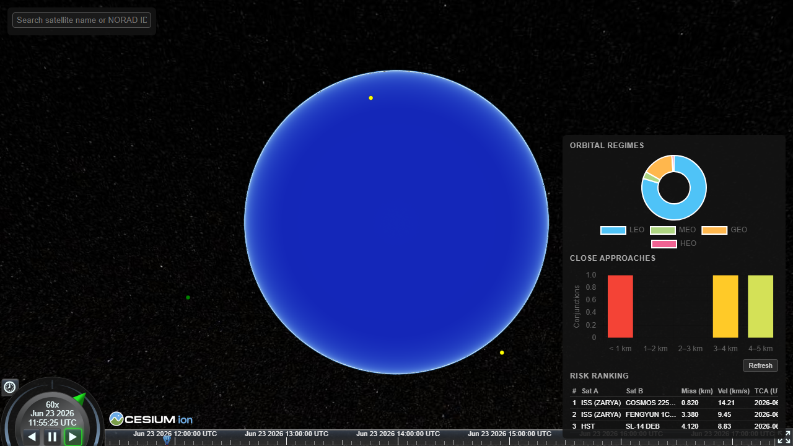
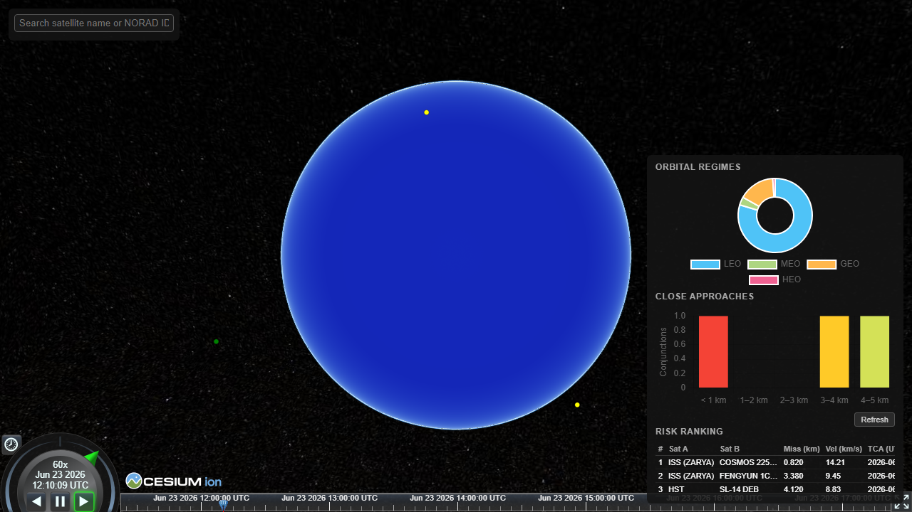

# Satellite Collision Risk Detector

A prototype system for identifying potential collision risks between Earth-orbiting satellites using publicly available orbital data.

> **Important**: This tool reports **potential close approaches** (miss distance in km), not collision probability. TLE data carries no covariance information — probability estimates require conjunction data messages (CDMs) from Space-Track, which are out of scope for this prototype.

---

## Live Demo

Deploy your own instance in minutes using the included `render.yaml` Blueprint (see [Deployment](#deployment) below).

> **Cold-start note**: Render free-tier services spin down after inactivity. The first request after a sleep may take 30–60 s while the container boots and re-seeds CelesTrak data.

---

## Overview

The Satellite Collision Risk Detector fetches Two-Line Element (TLE) orbital data from CelesTrak, propagates satellite positions forward in time using the SGP4 model, screens all surviving pairs for close approaches using a spatial index, refines the Time of Closest Approach (TCA), and presents the results on an interactive 3D globe with a risk dashboard.

The system identifies close approaches — events where two satellites pass within a configurable miss-distance threshold (default 5 km, matching CelesTrak SOCRATES) — and ranks them by proximity and relative velocity.

---

## Architecture

> Full detail: [docs/architecture.md](docs/architecture.md) — system diagram, data-flow narrative, coordinate-frame notes, and key constants.

```
CelesTrak GP API
      │ (fetch once per 2 h; cache locally; HTTP 403 → use cache)
      ▼
ingestion.py ──► tle_parser.py ──► SQLite (Satellite table)
                                         │
                                         ▼
                              propagation.py (SGP4 / SatrecArray)
                              ┌──────────────────────────────────┐
                              │ TEME frame for all conjunction   │
                              │ math (frame-independent geometry)│
                              │ → geodetic (lat/lon/alt) only at │
                              │   the display boundary           │
                              └──────────────────────────────────┘
                                         │
                                         ▼
                              conjunctions.py
                              ┌──────────────────────────────────┐
                              │ 1. apogee/perigee sieve (O(n))   │
                              │ 2. cKDTree screen (O(n log n))   │
                              │ 3. TCA refinement (~1 s dense)   │
                              │ 4. risk scoring + persist        │
                              └──────────────────────────────────┘
                                         │
                                         ▼
                              FastAPI REST API (api/)
                                         │
                         ┌───────────────┴───────────────┐
                         ▼                               ▼
               CesiumJS 3D globe              Chart.js dashboard
            (animated satellite tracks,     (regime distribution,
             red risk polylines)             approach counts,
                                             risk ranking table)
```

### Tech Stack

| Layer | Choice | Notes |
|-------|--------|-------|
| Backend | Python 3.11 / FastAPI / uvicorn | Async endpoints, auto OpenAPI |
| Orbital mechanics | `sgp4` + `skyfield` | `SatrecArray` bulk TEME propagation; skyfield for TEME→geodetic |
| Numerics | NumPy + SciPy `cKDTree` | Vectorized propagation + O(n log n) spatial neighbour search |
| TLE source | CelesTrak GP API | Free, no login; JSON/CSV/TLE formats |
| Database | SQLite via SQLAlchemy | Zero-config, file-based |
| Scheduler | APScheduler | 2-hourly TLE refresh + re-screen |
| HTTP client | httpx + tenacity | Fetch with 3-attempt exponential backoff |
| Config | pydantic-settings + `.env` | All thresholds/URLs/tokens via environment |
| Logging | Loguru | Structured logs with `request_id` |
| 3D globe | CesiumJS | Time-dynamic globe, offline Natural Earth imagery |
| Charts | Chart.js | Regime distribution, approach counts, risk ranking |
| Testing | pytest + Vitest + Playwright | Backend unit/integration; frontend unit; E2E |
| Linting | Ruff (line length 100) + Prettier | Backend + frontend |

---

## Data Sources

**CelesTrak General Perturbations (GP) API** — free, no login required.

- Data is updated by CelesTrak every **2 hours**; the app caches TLEs locally and re-downloads only when the cache is ≥ 2 hours old (one-download-per-update policy).
- If CelesTrak returns HTTP 403 (rate-limited or IP-blocked), the app automatically falls back to the cached copy without crashing.
- Never hammer the API — doing so will get the IP firewalled. The scheduler enforces the 2-hour cadence.

---

## Getting Started

### Prerequisites

- Python 3.11
- [`uv`](https://github.com/astral-sh/uv) package manager (replaces pip/requirements.txt)
- Node.js 18+ (frontend only)

### Local Development

```bash
# 1. Clone and enter the repo
git clone <repo-url>
cd satellite-collision-risk-detector

# 2. Create virtual environment and install dependencies
make install          # uv venv .venv --python 3.11 + uv pip install -e ".[dev]"

# 3. Copy and configure environment variables
cp .env.example .env  # fill in values as needed (all have defaults)

# 4. Seed the database (fetches TLEs from CelesTrak and runs the conjunction screen)
make seed

# 5. Start the backend API server (hot reload)
make local-dev        # serves on http://localhost:8000

# 6. In a separate terminal, start the frontend dev server
make serve-frontend   # serves on http://localhost:5173
```

**Windows note**: The Makefile uses `.venv/Scripts/` (Windows) path conventions. On Unix/Mac, replace `.venv/Scripts/` with `.venv/bin/` if running commands manually.

### Docker (docker-compose)

```bash
cp .env.example .env
docker compose up --build -d
docker compose exec backend python backend/scripts/seed.py
```

Backend available at `http://localhost:8000` · Frontend at `http://localhost:3000`.

### Environment Variables

All configuration is injected via environment variables — never hardcoded. See `.env.example` for the full list.

| Variable | Default | Notes |
|----------|---------|-------|
| `DATABASE_URL` | `sqlite:///./satellite_tracking.db` | SQLite file path |
| `TLE_CACHE_DIR` | `.tle_cache` | Directory for cached CelesTrak files |
| `CELESTRAK_BASE_URL` | `https://celestrak.org/GPS/gp.php` | CelesTrak GP API endpoint |
| `TLE_MAX_AGE_HOURS` | `2` | Cache TTL — re-download only if ≥ this many hours old |
| `SCREEN_WINDOW_HOURS` | `72` | How far ahead to screen for conjunctions |
| `SCREEN_STEP_SECONDS` | `60` | Timestep for the coarse position grid |
| `COARSE_RADIUS_KM` | `10` | cKDTree search radius for the spatial screen |
| `RISK_THRESHOLD_KM` | `5` | Miss-distance cutoff (matches CelesTrak SOCRATES) |
| `CESIUM_ION_TOKEN` | _(optional)_ | Only needed for Cesium ion imagery; offline Natural Earth works without it |
| `CORS_ORIGINS` | `http://localhost:5173` | Allowed frontend origins |

---

## Running Tests

```bash
# Backend (pytest)
make local-test

# Frontend (Vitest)
npm --prefix frontend run test

# End-to-end (Playwright — requires seeded DB + running backend)
npx playwright test
```

---

## API Reference

Base URL: `http://localhost:8000` (local dev) or your deployed host.

Interactive docs available at `/docs` (Swagger UI) and `/redoc`.

### Health

| Method | Path | Description |
|--------|------|-------------|
| GET | `/health` | Returns `{"status": "ok"}` — used by Render health checks |

### Satellites

| Method | Path | Query Params | Description |
|--------|------|-------------|-------------|
| GET | `/satellites` | `group`, `regime`, `limit` (default 100, max 1000), `offset` | List satellites; filter by CelesTrak group or orbital regime (LEO/MEO/GEO/HEO) |
| GET | `/satellites/{id}` | — | Satellite detail: metadata + orbital elements + regime. 404 if unknown |
| GET | `/satellites/{id}/positions` | `start` (ISO-8601), `stop` (ISO-8601), `step` (seconds, default 60) | Propagated geodetic track for one satellite; used by Cesium `SampledPositionProperty` |
| GET | `/satellites/positions` | `ids` (comma-separated), `start`, `stop`, `step` | Bulk positions for up to 500 satellites in one call |

### Conjunctions

| Method | Path | Query Params | Description |
|--------|------|-------------|-------------|
| GET | `/conjunctions` | `threshold` (km, default 5), `window` (hours, default 72), `limit` (default 100, max 500) | List conjunction events within the threshold and look-ahead window, ordered by miss distance |
| GET | `/conjunctions/{pair_id}` | — | Single conjunction detail. 404 if unknown |

### Stats

| Method | Path | Query Params | Description |
|--------|------|-------------|-------------|
| GET | `/stats/orbital-regions` | — | Satellite counts per regime (LEO, MEO, GEO, HEO) plus total |
| GET | `/stats/risk-ranking` | `limit` (default 10, max 100) | Top-N riskiest conjunctions ordered by miss distance (tie-break: relative velocity) |

---

## Screenshots

### Globe — animated satellite tracks

Satellites coloured by orbital regime (yellow = LEO, green = MEO, cyan = GEO, red = HEO) rendered on an offline Natural Earth globe with time-animated tracks.



### Globe — risk polylines

Red polylines connect at-risk pairs (miss distance ≤ 1 km) and orange lines show pairs within the 5 km threshold. Polylines track the moving satellites as the Cesium clock advances.



### Insights dashboard

The dashboard panel (bottom-right) shows the orbital-regime distribution chart, close-approach count chart, and the risk ranking table sorted by miss distance.


---

## Deployment

### Render.com (recommended — one-click Blueprint)

1. Push this repo to GitHub.
2. Sign in at [dashboard.render.com](https://dashboard.render.com) → **New → Blueprint**.
3. Connect the repo — Render detects `render.yaml` automatically.
4. Optionally set `CORS_ORIGINS` and `CESIUM_ION_TOKEN` in the Environment tab.
5. Click **Apply** — Render builds the Docker image, runs `seed.py`, and starts uvicorn.

The `startCommand` in `render.yaml` runs `seed.py` before launching uvicorn, so CelesTrak TLE data is populated on every cold boot. `seed.py` is idempotent — safe to re-run.

### Local Docker

```bash
cp .env.example .env
docker compose up --build -d
docker compose exec backend python backend/scripts/seed.py
```

---

## Project Structure

```
backend/app/
├── main.py                 # FastAPI entry point, lifespan, routers
├── core/config.py          # All settings from .env (pydantic-settings)
├── db/
│   ├── database.py         # SQLAlchemy engine + get_db()
│   └── models.py           # Satellite + Conjunction ORM models
├── models/schemas.py       # Pydantic request/response schemas
├── api/
│   ├── satellites.py       # /satellites, /satellites/{id}, /positions
│   ├── conjunctions.py     # /conjunctions
│   └── stats.py            # /stats/orbital-regions, /stats/risk-ranking
└── services/
    ├── ingestion.py        # CelesTrak fetch + 2h cache + persist
    ├── tle_parser.py       # TLE field parse + checksum validation
    ├── propagation.py      # SGP4/skyfield → TEME + geodetic
    ├── classification.py   # Orbital elements + LEO/MEO/GEO/HEO
    ├── conjunctions.py     # Sieve → cKDTree → TCA → risk score
    └── scheduler.py        # APScheduler 2h refresh + re-screen
backend/scripts/seed.py     # Initial fetch + screen + populate DB
frontend/src/
    ├── cesiumView.js       # Globe, entities, SampledPositionProperty, clock
    ├── api.js              # Fetch wrappers (base URL switch mock ↔ live)
    ├── risk.js             # At-risk polylines + CallbackProperty tracking
    ├── search.js           # Search + flyTo
    ├── infoPanel.js        # Selected-satellite details
    └── dashboard.js        # Chart.js panels
specs/                      # Spec-driven development docs
roadmap.md                  # Full spec index (source of truth)
```

---

## Disclaimer

This project is for educational and research purposes. The prototype uses distance-based conjunction screening (miss distance) and should **not** be used for operational collision avoidance decisions. Collision *probability* requires covariance data (CDMs) not present in TLEs.

---

## Author

- Aryan Singh — `0309.aryansingh@gmail.com`
