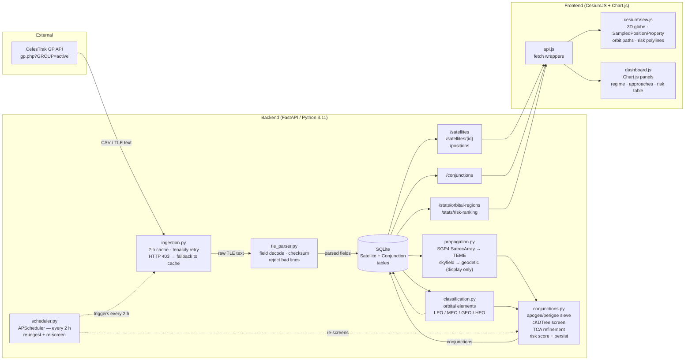

# Architecture — Satellite Collision Risk Detector

## System Diagram

---

## Data-Flow Narrative

### 1 — Fetch
`ingestion.py::fetch_group()` issues an HTTP GET to the CelesTrak GP API
(`gp.php?GROUP=active&FORMAT=csv`) via `httpx`. Tenacity wraps the call with 3
attempts and exponential back-off (1 s → 10 s). If the server returns HTTP 403
(rate-limit / firewall), the caller catches the error and falls back to the
locally cached copy — the live API is never retried in the same cycle.

### 2 — Cache
Before every fetch, `ingestion.py` checks the age of the on-disk cache file
(path from `settings.TLE_CACHE_DIR`). If the file is younger than
`settings.TLE_MAX_AGE_HOURS` (2 h), the download is skipped entirely and the
cached data is returned — enforcing the CelesTrak one-download-per-update
policy. A missing cache file always triggers a fresh download.

### 3 — Parse
`tle_parser.py::parse_tle()` decodes each TLE line pair: catalog number,
international designator, epoch (2-digit year + day-of-year → UTC datetime),
inclination, RAAN, eccentricity (implied leading `0.`), argument of perigee,
mean anomaly, mean motion (rev/day), and BSTAR drag term (exponent-encoded,
e.g. `35580-4` → 0.0000356). Lines that fail the modulo-10 checksum or are not
exactly 69 characters are rejected with a `TLEParseError`; the rest of the
batch is not affected.

### 4 — Persist satellites
`ingestion.py::ingest_group()` upserts parsed records into the `Satellite` table
keyed on `catalog_no`. Raw `line1` and `line2` are stored byte-for-byte so
satellites can be deterministically re-propagated at any later time without
re-fetching. `classification.py::derive_orbital_elements()` computes semi-major
axis, eccentricity, period, apogee, and perigee from TLE fields; the regime
label (LEO / MEO / GEO / HEO) is stored alongside.

### 5 — Propagation
`propagation.py` serves two roles:

- **Bulk (screening)**: `propagate_array()` assembles a `SatrecArray` from all
  stored TLEs and calls `SatrecArray.sgp4()` to get TEME position vectors (km)
  and velocity vectors (km/s) for every satellite at every time step in one
  vectorised call. Output shape: `(n_sats, n_times, 3)`. Satellites whose SGP4
  error code is nonzero (e.g. code 6 = decayed orbit) are flagged and excluded
  from conjunction screening.
- **Display**: `propagate_geodetic()` uses `skyfield`'s `EarthSatellite` +
  `wgs84.subpoint` to convert TEME positions to geodetic lat / lon / alt for the
  Cesium globe. This conversion happens only at the API boundary — never inside
  the conjunction engine.

### 6 — Apogee / perigee sieve
`conjunctions.py::apogee_perigee_sieve()` eliminates satellite pairs whose
orbital shells cannot geometrically intersect. The rule:
`reject if perigee_A − apogee_B > pad OR perigee_B − apogee_A > pad`
with a default pad of 30 km. This O(n²) but branch-heavy filter removes the
vast majority of pairs (e.g. GEO–LEO) before any propagation occurs.

### 7 — cKDTree spatial screen
`conjunctions.py::ckdtree_screen()` propagates surviving candidate pairs over
`settings.SCREEN_WINDOW_HOURS` at `settings.SCREEN_STEP_SECONDS` steps. At
each timestep it builds a `scipy.spatial.cKDTree` over all candidate positions
and calls `query_pairs(r=COARSE_RADIUS_KM)` to find neighbours within the
coarse radius. Pairs flagged at any timestep proceed to TCA refinement. If no
pairs are flagged, an empty list is returned — not an error.

### 8 — TCA refinement
`conjunctions.py::refine_tca()` re-propagates each flagged pair at ~1 s
resolution in a narrow bracket around the coarse minimum. It detects the
range-rate zero-crossing (`r_rel · v_rel` changes sign) to locate the exact
Time of Closest Approach (TCA), miss distance (km), and relative velocity
(km/s). All geometry is computed in TEME.

### 9 — Risk scoring and persist
`conjunctions.py::score_and_persist()` retains only events with
`miss_km ≤ RISK_THRESHOLD_KM` (5 km), ranks survivors by miss distance
(tie-broken by relative velocity), and upserts them into the `Conjunction` table
keyed on `(sat_a, sat_b, window_start)` — making the operation idempotent.

### 10 — Scheduled refresh
`scheduler.py` registers an APScheduler `IntervalTrigger` job (interval = 2 h)
in the FastAPI lifespan. Each firing re-runs ingestion (respecting the 2-h
cache) and the full conjunction screen. Job failures are logged and isolated —
the API continues serving stale-but-valid data rather than crashing.

### 11 — REST API
Three FastAPI routers expose the SQLite data to the frontend:

| Router | Endpoints |
|--------|-----------|
| `satellites.py` | `GET /satellites`, `GET /satellites/{id}`, `GET /positions` |
| `conjunctions.py` | `GET /conjunctions`, `GET /conjunctions/{pair_id}` |
| `stats.py` | `GET /stats/orbital-regions`, `GET /stats/risk-ranking` |

All responses are serialised through Pydantic models in `schemas.py`.
Unknown satellite IDs return 404; empty result sets return `[]`, not errors.

### 12 — Frontend render
`api.js` provides typed `fetch` wrappers for every endpoint, switching between
a mock server (development) and the live backend. `cesiumView.js` builds a
`SampledPositionProperty` per satellite from `/positions` data, drives the
Cesium clock for time-animated orbit tracks, and draws `CallbackProperty`
polylines between each at-risk pair from `/conjunctions`. `dashboard.js`
renders three Chart.js panels: regime distribution (doughnut), close-approach
counts (bar), and risk ranking (table). All panels poll for fresh data on a
configurable interval.

---

## Coordinate Frames

All conjunction math — separation distance, TCA detection, miss distance (km),
and relative velocity (km/s) — is performed entirely in **TEME** (True Equator
Mean Equinox / ECI). TEME is the native output frame of the SGP4 algorithm, and
relative geometry between two satellites is frame-independent within a single
instant, so no intermediate frame conversion is required.

**WGS-72 gravity constants** are used in the SGP4 propagator (via
`sgp4.api.Satrec.twoline2rv` defaults). This is correct because TLEs are
generated with WGS-72 — switching to WGS-84 constants would introduce systematic
errors of order tens of metres over a propagation period.

Conversion to **geodetic coordinates** (latitude, longitude, altitude) is
performed only once, at the display boundary in `propagation.py`, using
`skyfield`'s `wgs84.subpoint()`. These geodetic values are used exclusively by
the Cesium globe to render satellite markers and orbit paths.

> **Important caveat**: This tool reports **potential close approaches (miss
> distance)**, not collision probability. TLE data carries no covariance
> information; computing a probability of collision requires conjunction data
> messages (CDMs) with full position/velocity covariance matrices, which are
> out of scope for this prototype.

---

## Tech Stack

| Concern | Library / Tool | Rationale |
|---------|---------------|-----------|
| Bulk propagation | `sgp4` `SatrecArray` | Vectorised TEME pos/vel for the whole catalogue in one call |
| Display positions | `skyfield` + `wgs84.subpoint` | Accurate TEME → geodetic for Cesium markers and orbit paths |
| Neighbour search | `scipy.spatial.cKDTree` | O(n log n) `query_pairs` per timestep; handles thousands of satellites |
| Storage | SQLite + SQLAlchemy | Zero-config file-based DB; ORM upserts keep ingestion idempotent |
| Scheduling | APScheduler | `IntervalTrigger` 2-h job wired into FastAPI lifespan; failures isolated |
| HTTP client | `httpx` + `tenacity` | Async fetch; 3-attempt exponential back-off; 403 → cache fallback |
| Config | `pydantic-settings` | All thresholds, URLs, and tokens from `.env`; validated on startup |
| Logging | `Loguru` | Structured logs with `request_id` context on every request |
| 3D globe | CesiumJS | `SampledPositionProperty` + clock animation; offline Natural Earth imagery |
| Charts | Chart.js | Regime doughnut, approach bar, risk ranking table in the dashboard |

---

## Key Constants and Thresholds

| Constant | Value | Source / Usage |
|----------|-------|---------------|
| Gravitational parameter μ | 398600.4418 km³/s² | Semi-major axis: `a = (μ / n_rad²)^(1/3)` |
| Risk threshold | 5 km | Matches CelesTrak SOCRATES; conjunctions with `miss_km > 5 km` discarded |
| Coarse cKDTree radius | 10–20 km (default 20 km) | Generous to bridge fast crossings between coarse time steps |
| TCA dense re-propagation step | ~1 s | Resolves range-rate zero-crossing to sub-kilometre accuracy |
| TLE refresh cadence | 2 h | CelesTrak one-download-per-update policy |
| Screening window | 24–72 h (default 72 h) | Set via `SCREEN_WINDOW_HOURS` in `.env` |
| Screening time step | 30–60 s (default 60 s) | Set via `SCREEN_STEP_SECONDS` in `.env` |
| Apogee/perigee sieve pad | 30 km | Eliminates non-intersecting shell pairs before propagation |
| **Regime boundaries** | | Based on mean motion `n` (rev/day) and eccentricity `e` |
| HEO | e ≥ 0.25 | Highly elliptical orbits (Molniya, Tundra) |
| LEO | n ≥ 11.25 rev/day | Low Earth orbit (< ~2 000 km altitude) |
| MEO | 1.2 ≤ n < 11.25 rev/day | Medium Earth orbit (GPS, Galileo) |
| GEO | n < 1.2 rev/day | Geostationary / graveyard belt |
